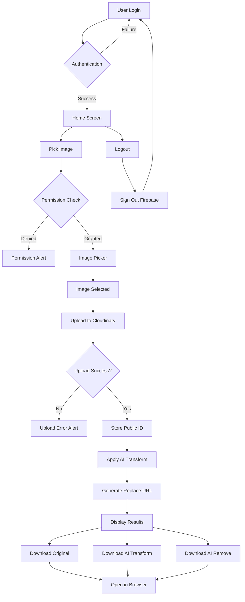
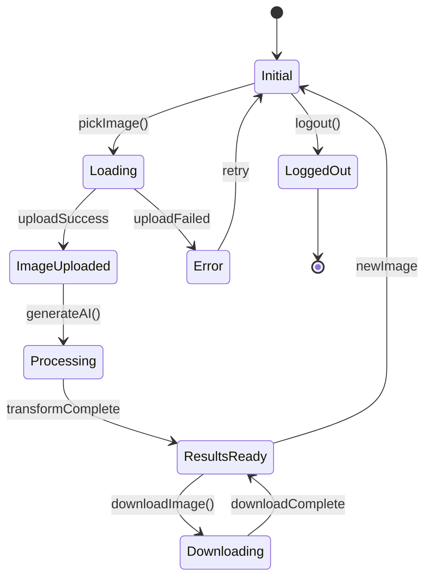
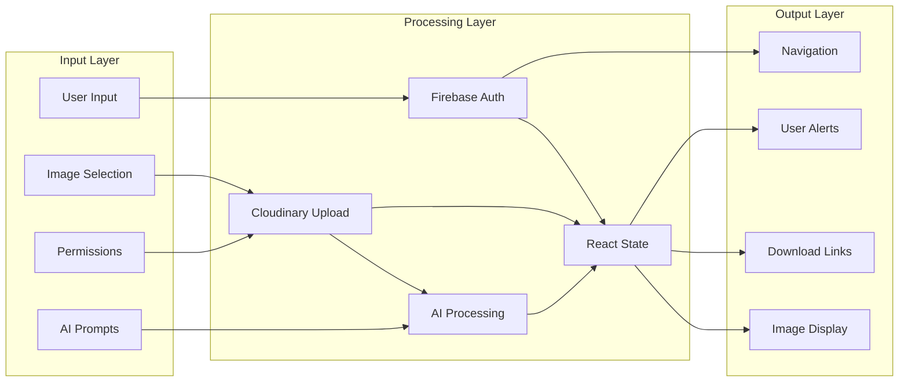
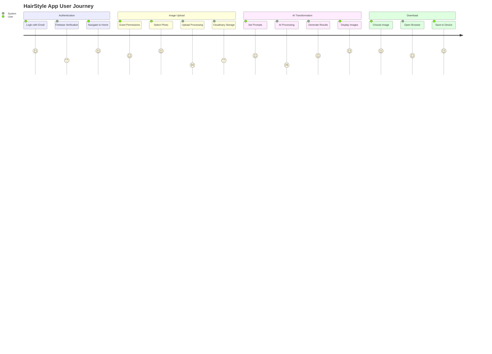
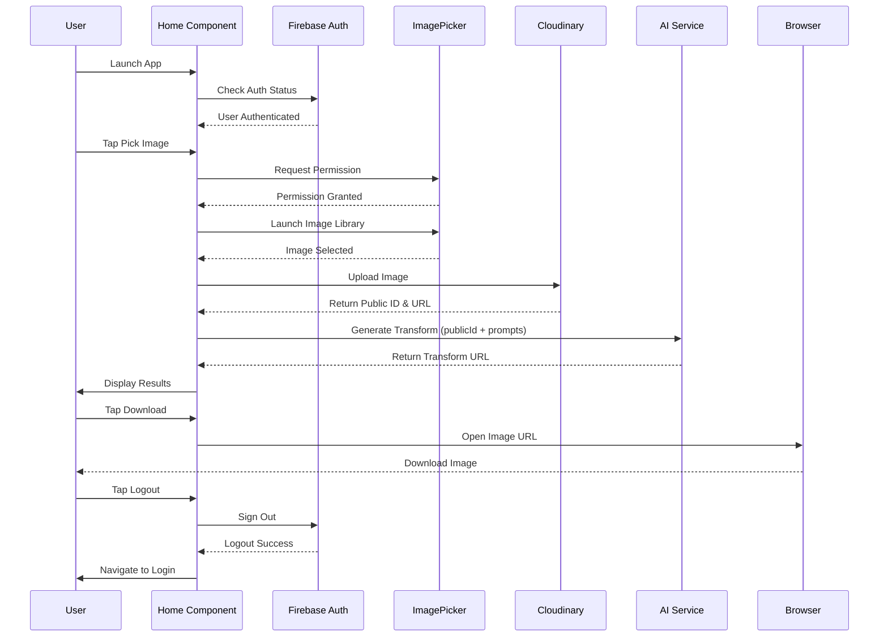
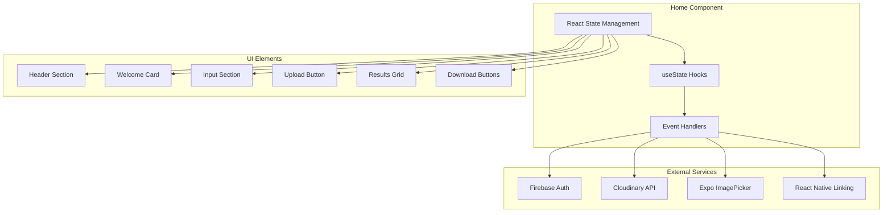
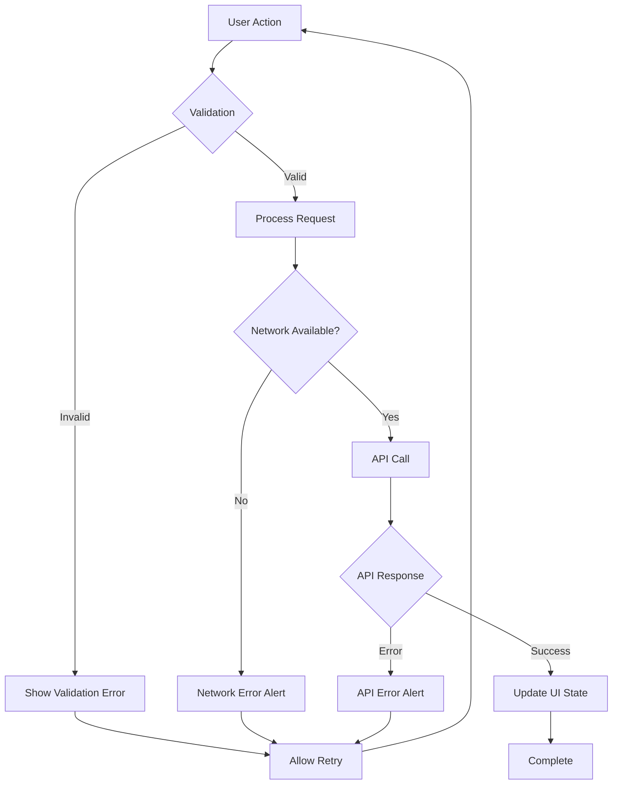
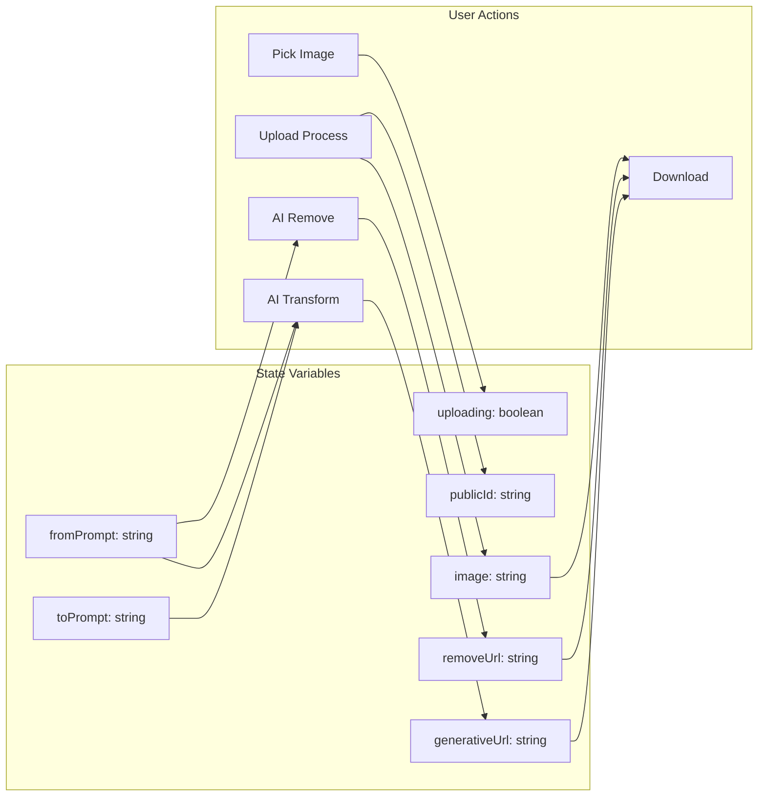

# HairStyle App 💇‍♀️

A React Native mobile application that uses AI to transform hairstyles in photos. Built with Expo, Firebase Authentication, and Cloudinary AI services.

## 🌟 Features

- **AI-Powered Transformations**: Replace and remove elements in photos using Cloudinary's generative AI
- **Real-time Processing**: Upload and transform images instantly
- **User Authentication**: Secure login/logout with Firebase Auth
- **Download Functionality**: Save transformed images to device
- **Modern UI**: Dark theme with gradient design and smooth animations

## 🏗️ System Architecture

### Technology Stack
- **Frontend**: React Native with Expo SDK 54
- **Authentication**: Firebase Auth
- **Image Processing**: Cloudinary AI APIs
- **State Management**: React Hooks (useState)
- **Navigation**: Expo Router
- **Image Picker**: Expo ImagePicker

## 📊 IPO Analysis

### **INPUT**
- User credentials (email/password)
- Images from device gallery
- AI transformation prompts
- User interactions (buttons, text input)
- Device permissions

### **PROCESS**
- Firebase authentication
- Image upload to Cloudinary
- AI transformation processing
- State management
- URL generation for downloads

### **OUTPUT**
- Authenticated user sessions
- Original and transformed images
- Download capabilities
- User feedback (alerts, loading states)
- Navigation between screens

## 🔄 System Flow Diagrams

### 1. Main Application Flow



### 2. Component State Management



### 3. Data Flow Architecture



### 4. User Journey Map



### 5. Detailed Sequence Diagram



### 6. Component Architecture



### 7. Error Handling Flow



### 8. State Variables Management



## 🚀 Getting Started

### Prerequisites
- Node.js (v16 or higher)
- Expo CLI
- Expo Go app on your mobile device
- Firebase project setup
- Cloudinary account

### Installation

1. **Clone the repository**
   ```bash
   git clone <repository-url>
   cd HairStyleApp
   ```

2. **Install dependencies**
   ```bash
   npm install
   ```

3. **Configure environment variables**
   - Set up Firebase configuration in `firebaseConfig.js`
   - Configure Cloudinary credentials in `components/cloudinary.js`

4. **Start the development server**
   ```bash
   npm start
   ```

5. **Run on device**
   - Scan QR code with Expo Go app
   - Or use `npm run android` / `npm run ios`

## 📱 App Structure

```
HairStyleApp/
├── app/
│   ├── home.tsx          # Main app screen
│   ├── index.tsx         # Login screen
│   └── _layout.tsx       # App layout
├── components/
│   ├── cloudinary.js     # Cloudinary upload
│   └── cloudinaryGen.js  # AI transformations
├── firebaseConfig.js     # Firebase setup
└── package.json          # Dependencies
```

## 🎨 UI Components

### Home Screen Features
- **Header**: App title, subtitle, logout button
- **Welcome Card**: User greeting with email
- **Input Section**: AI transformation prompts
- **Upload Button**: Image selection with loading states
- **Results Grid**: Original and transformed images
- **Download Buttons**: Individual download for each image

### Styling
- **Dark Theme**: Modern dark slate background
- **Gradient Headers**: Blue to purple gradient
- **Card Design**: Elevated cards with shadows
- **Responsive Layout**: Adapts to different screen sizes

## 🔧 Configuration

### Firebase Setup
```javascript
// firebaseConfig.js
import { initializeApp } from 'firebase/app';
import { getAuth } from 'firebase/auth';

const firebaseConfig = {
  // Your Firebase configuration
};

const app = initializeApp(firebaseConfig);
export const auth = getAuth(app);
```

### Cloudinary Setup
```javascript
// components/cloudinary.js
const CLOUDINARY_URL = 'your-cloudinary-url';
const UPLOAD_PRESET = 'your-upload-preset';
```

## 🛠️ Key Dependencies

- **expo**: ~54.0.0
- **react-native**: 0.76.3
- **firebase**: ^11.0.2
- **expo-image-picker**: ~16.0.2
- **expo-router**: ~4.0.9
- **react-native-reanimated**: ~4.1.1
- **react-native-worklets**: 0.5.1

## 📖 API Reference

### Main Functions

#### `pickImage()`
- Requests camera roll permissions
- Launches image library
- Handles image selection and upload

#### `uploadImage(uri: string)`
- Uploads image to Cloudinary
- Stores public ID for transformations
- Generates AI-transformed images

#### `downloadImage(imageUri: string, imageName: string)`
- Opens image URL in browser
- Enables image download/save

#### `logout()`
- Signs out from Firebase
- Navigates back to login screen

## 🔒 Security Features

- **Firebase Authentication**: Secure user login/logout
- **Cloudinary Secure URLs**: Protected image storage
- **Permission Handling**: Proper camera roll access
- **Error Handling**: Comprehensive error management

## 🎯 Future Enhancements

- [ ] Multiple image transformations
- [ ] Social sharing capabilities
- [ ] User profile management
- [ ] Image history and favorites
- [ ] Offline mode support
- [ ] Push notifications

## 📄 License

This project is licensed under the MIT License - see the LICENSE file for details.

## 🤝 Contributing

1. Fork the repository
2. Create your feature branch (`git checkout -b feature/AmazingFeature`)
3. Commit your changes (`git commit -m 'Add some AmazingFeature'`)
4. Push to the branch (`git push origin feature/AmazingFeature`)
5. Open a Pull Request

## 📞 Support

For support and questions, please contact:
- Email: support@hairstyleapp.com
- GitHub Issues: [Create an issue](../../issues)

---

**Built with ❤️ using React Native and Expo**